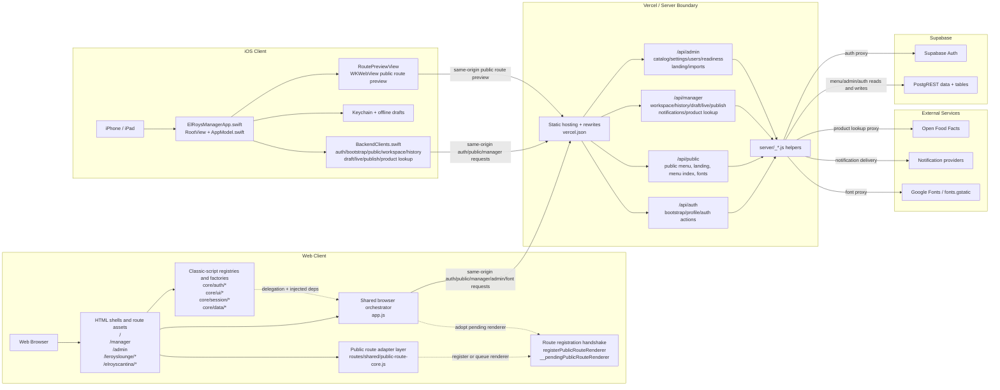

# Current Architecture Flow Chart

This map reflects the current tracked repo state on 2026-04-22 at `HEAD`
`129594a`.

## Boundary Policy

Required direction:

- Web client -> server -> Supabase / external services
- iOS client -> server -> Supabase / external services
- No tracked client code should call Supabase or third-party services directly

Current result:

- The repo now mostly satisfies that policy.
- The web client and iOS client call same-origin API handlers only.
- Supabase Auth, Supabase PostgREST, Open Food Facts, notification providers,
  and Google Fonts are all reached from server code, not from tracked client
  code.

## Current State

## What Is Compliant Today

- Web auth is same-origin through `/api/auth` in `core/auth/auth-api.js` and the
  runtime fallback in `app.js`.
- Web public menu, workspace, history, draft, live save, publish, admin reads,
  landing-page reads, and readiness checks all run through `/api/public`,
  `/api/manager`, or `/api/admin` in `app.js`.
- Web barcode lookup posts to `/api/manager` from
  `core/ui/manager/open-food-facts.js`.
- Root, manager, admin, and route-specific font loading now points to
  `/api/public?action=font_css...`, with the server proxying Google Fonts.
- iOS bootstrap, auth, public menu, workspace, history, draft, live save,
  publish, and barcode lookup all go through same-origin API paths in
  `ios/ElRoysManagerApp/Clients/BackendClients.swift`.
- Public featured strips on web routes and iOS public readers come from the
  server's `featuredItems` projection, which `server/_menu-read.js` derives
  from each menu's hidden `featured_specials` category instead of a
  restaurant-level specials transport.
- Restaurant Tools remains on the compliant client -> server -> service path,
  but it now acts as menu-scoped guidance into category and item editors rather
  than transporting or mutating separate featured-slot state.

## Direct Client-To-Service Violations Found

- None found in tracked web or iOS source.

The current tracked client boundary is:

- client -> `/api/auth|public|manager|admin` -> server helpers -> Supabase /
  external service

## Important Notes

- `api/auth` still returns `config.supabaseUrl` and `config.supabaseAnonKey`,
  but they are compatibility shim values set to `"server-managed"`, not real
  client credentials.
- Web and iOS still decode and store those compatibility fields to keep session
  bootstrap and restore flows stable.
- The web runtime is still order-dependent inside the browser even though its
  network boundary is clean. All HTML shells load `core/*` registries before
  `app.js`, and that order is enforced by `scripts/check-html-script-order.cjs`.
- Public routes use a two-step renderer handshake. Route code can queue a
  pending renderer before `app.js` is ready, and `app.js` later adopts it
  through `registerPublicRouteRenderer`.
- The primary session lifecycle path no longer reaches back through an ambient
  `globalScope.createMenuPublishService` lookup. `app.js` now injects publish
  creation into `core/session/menu-session.js`, but compatibility fallbacks and
  other global shims still exist in parts of `core/session/*`, `core/data/*`,
  and the auth overlay template.
- `server/_menu-read.js` still contains legacy featured-group fallback reads
  against `featured_groups` and `featured_slots` for migration safety, but the
  tracked public and workspace contracts now center on menu-owned categories,
  `featuredItems`, and menu publish metadata instead of a live restaurant-tools
  specials transport.
- Google Fonts is still an external dependency, but the browser does not talk
  to it directly anymore. The server proxy in `server/_font-proxy.js` owns that
  boundary.

## Concrete Boundary References

- Web auth boundary:
  - `core/auth/auth-api.js`
  - `app.js`
  - `api/auth.js`
  - `server/_auth-proxy.js`
- Web public/menu/admin boundary:
  - `app.js`
  - `leroyslounge/app.js`
  - `elroyscantina/app.js`
  - `server/_menu-read.js`
  - `api/public.js`
  - `api/manager.js`
  - `api/admin.js`
- Web barcode lookup boundary:
  - `core/ui/manager/open-food-facts.js`
  - `api/manager.js`
  - `server/_product-lookup.js`
- Font boundary:
  - `index.html`
  - `manager/index.html`
  - `admin/index.html`
  - `leroyslounge/style.css`
  - `elroyscantina/style.css`
  - `api/public.js`
  - `server/_font-proxy.js`
- iOS boundary:
  - `ios/ElRoysManagerApp/Clients/BackendClients.swift`
  - `ios/ElRoysManagerApp/App/AppModel.swift`
  - `ios/ElRoysManagerApp/Models/AppModels.swift`
  - `ios/ElRoysManagerApp/Features/Public/PublicMenuViews.swift`
  - `ios/ElRoysManagerApp/Features/RestaurantTools/RestaurantToolsView.swift`

## Remaining Cleanup

1. Remove the bootstrap `config` shim once web and iOS session restore no
   longer expect `supabaseUrl` and `supabaseAnonKey`.
2. Decide whether server-proxied Google Fonts is good enough, or whether fonts
   should be fully self-hosted to remove the server-to-Google dependency too.

## Unknowns

- No client-boundary unknowns were found from tracked code inspection.
